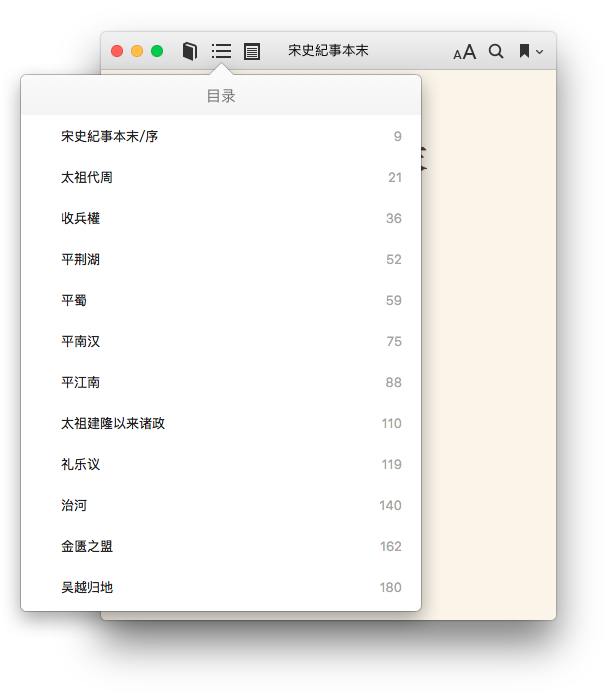
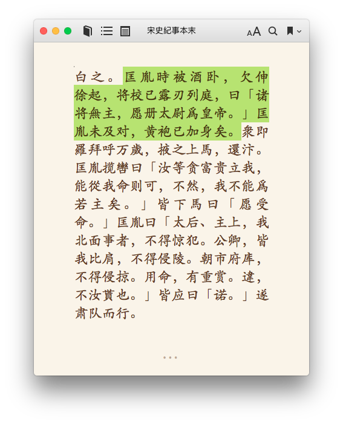

## wsepub

A python script for generating epub file for Chinese classic text from
 [zh.wikisource.org][1]. 
 
I wrote it for [《宋史纪事本末》][2], but it should works for any Chinese classic books published on wikisource.

Refer to [samples](./samples) folder for the actual epub files.

### Features

1. Generate a well-formated epub file automatically from the index page of a book.
2. Generate table of content and navigation page.
3. Replace English quote mark("") to Chinese quote mark(「」).


### Screenshots





## Usage

```
python wikisource.py http://the/link/of/the/book
```

[1]: http://zh.wikisource.org
[2]: https://zh.wikisource.org/zh/%E5%AE%8B%E5%8F%B2%E7%B4%80%E4%BA%8B%E6%9C%AC%E6%9C%AB